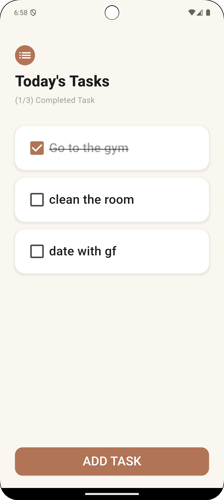
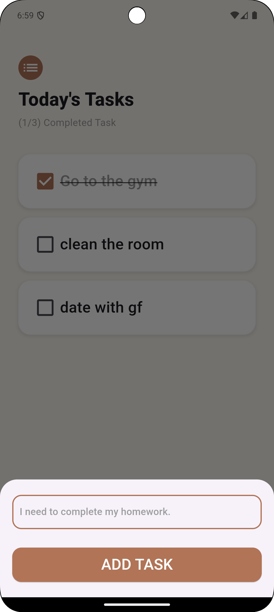
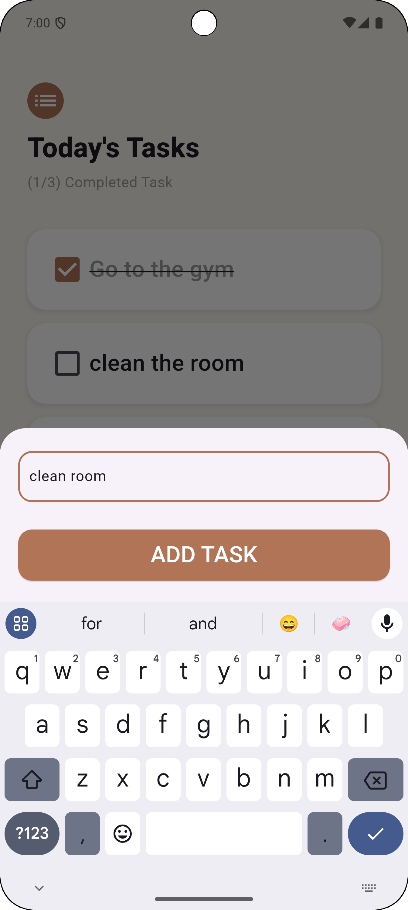
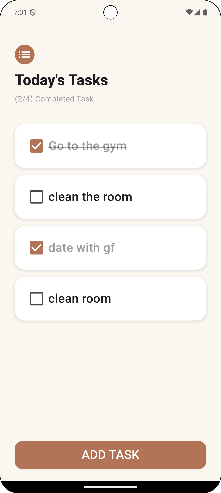
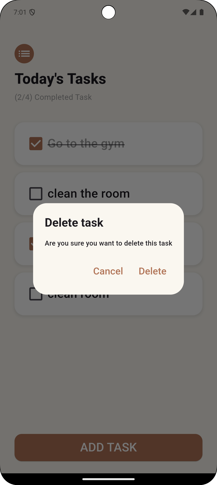

# ToDo App

A simple and intuitive ToDo app built with Flutter and Provider for state management. This app allows users to create, delete, and manage tasks efficiently. The interface is designed to be user-friendly and visually appealing.

## Features

- **Create Tasks**: Easily add new tasks to your to-do list.
- **Delete Tasks**: Long press on a task to delete it with a confirmation dialog.
- **Mark as Done**: Check off tasks to mark them as completed.
- **State Management**: Utilizes the Provider package for efficient state management.

## Technologies Used

- **Flutter**: The UI toolkit for building natively compiled applications for mobile, web, and desktop from a single codebase.
- **Provider**: A state management library for Flutter that makes it easy to manage application state.

## Screenshots
<p float="left">
  
  
</p>

<p float="left">
  
  
</p>

<p float="left">
  
</p>

### Installation

1. Clone the repository:
   ```bash
   git clone https://github.com/risal-ea/todo-app.git

2. Navigate to the project directory:
    ```bash
    cd todo_app

3. Install dependencies:
    ```bash
    flutter pub get

4. Run the app:
    ```bash
    flutter run
